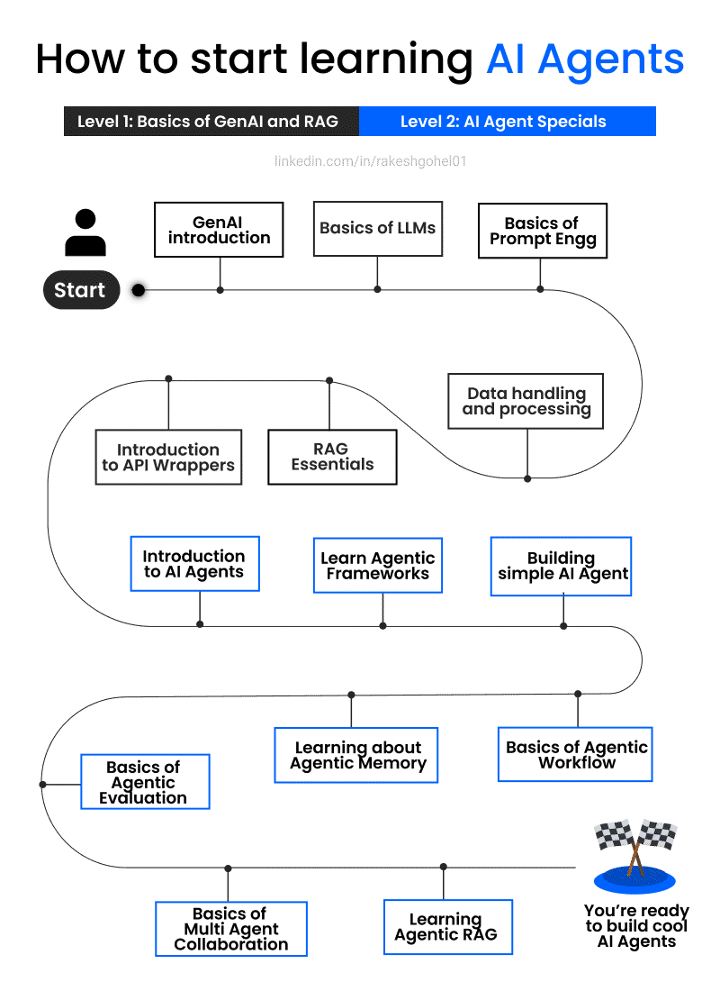

# 2025: The Year of Agents 🚀  

<video controls src="media/runner-H.mp4" style="max-width:100%; height:auto;">Your browser does not support the video tag.</video>

If you’ve been paying attention, you know I’ve shared several roadmaps this year on AI engineering, research, and getting into the space quickly and efficiently. But this? This is my **final one for 2024**, and it’s a game-changer.

**2025 is the year of agents.**  
Multi-agent systems are about to take over the AI landscape, and if you’re not ahead of the curve, you’ll be playing catch-up when the industry moves forward. December is your month to lock in the knowledge and be ready to dominate 2025.  

  
Image Credit: [Rakesh Gohel on LinkedIn](https://www.linkedin.com/posts/rakeshgohel01_many-of-you-asked-for-an-ai-agent-learning-activity-7268270873931853824-3a3z/) 

--- 

## **Why Agents Matter**
Agents aren’t just a buzzword—they’re systems that think, act, and collaborate to automate entire workflows. From managing travel pipelines to optimizing complex processes, **agents are the future of AI**. Whether you’re in tech, business, or even creative industries, agents are going to shape how we work, live, and solve problems.

---

## **Why Agents Matter**
Agents aren’t just a buzzword—they’re systems that think, act, and collaborate to automate entire workflows. From managing travel pipelines to optimizing complex processes, **agents are the future of AI**. Whether you’re in tech, business, or even creative industries, agents are going to shape how we work, live, and solve problems.

### What This Roadmap Covers
I’ve curated **five powerful, practical courses** that will give you the skills to build advanced agent systems—from scratch to production. These aren’t your average, mediocre courses. These are the ones that matter.

---

## **The 5 Courses to Master Agents**

### 1. **AI Agents in LangGraph**  
- **Platform:** DeepLearning.AI  
- **Why Learn This:** Master building flow-based AI agents using LangGraph, an extension of LangChain. You’ll learn how to create modular, scalable systems that can handle complex workflows like a pro.  
- **Start Here:** [AI Agents in LangGraph](https://www.deeplearning.ai/short-courses/ai-agents-in-langgraph/)

---

### 2. **Building Multi-Agent Systems with crewAI**  
- **Platform:** DeepLearning.AI  
- **Why Learn This:** This project-based learning experience focuses on agent collaboration. Perfect for systems where agents need to work together, like coordinating notifications, rebookings, and flight tracking.  
- **Start Here:** [Multi-Agent Systems with crewAI](https://www.coursera.org/projects/multi-ai-agent-systems-with-crewai)

---

### 3. **Functions, Tools, and Agents with LangChain**  
- **Platform:** DeepLearning.AI  
- **Why Learn This:** Dive into LangChain’s function-calling features to integrate tools, APIs, and workflows. Build agents that use reasoning, tool selection, and routing logic to solve real-world problems.  
- **Start Here:** [LangChain Functions and Tools](https://www.deeplearning.ai/short-courses/functions-tools-agents-langchain/)

---

### 4. **AI Agents: Automation & Business with LangChain & LLM Apps**  
- **Platform:** Udemy  
- **Why Learn This:** Build enterprise-level agents that automate high-value workflows. Learn how to scale solutions for real-world applications like business automation and process optimization.  
- **Start Here:** [LangChain & LLM Apps](https://www.udemy.com/course/ai-agents-automation-business-with-langchain-llm-apps/)

---

### 5. **RAG Agents for Production with LangChain & LlamaIndex**  
- **Platform:** Activeloop  
- **Why Learn This:** Learn retrieval-augmented generation agents with structured lessons and hands-on projects. By the time you finish, you’ll be ready to deploy powerful RAG workflows in production.  
- **Start Here:** [RAG Agents for Production](https://learn.activeloop.ai/courses/rag)

---

## **Why Start Now?**
It’s December 4th. Most people will use this month to wind down, relax, or maybe dabble in holiday plans. But if you want to **lead the charge in 2025**, now’s the time to **put in the work**. Spend this December immersing yourself in agents. By the time January hits, you’ll be ahead of 90% of the field.

**What’s the payoff?**  
- You’ll know how to build scalable agent systems from scratch.  
- You’ll be prepared to tackle multi-agent workflows that can disrupt industries.  
- You’ll have the skills to create solutions that are as innovative as they are practical.

---

## **Final Note**
This is it. The roadmap to dominate the **agentic revolution**. Use this month wisely. December is your launchpad, and 2025 is the year you soar.  

When the industry looks back, those who understood agents will be the ones leading the future. Are you ready to be one of them?

Let’s get it. 🔥
